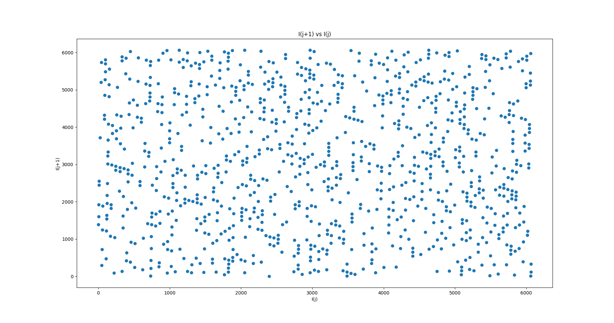

# Assignment-2
# 2021101113
# Science - II
# Q1
# Gowlapalli Rohit
>##### All these commands are tested on Ubuntu Version 20.04.3 LTS (Focal Fossa) 
```
Q1
├── Q1a.py
├── Q1b.py
├── Q1c.py
└── Q1.pdf
```
>* Q1-part-a


>* Q1-part-b
```
Now if I is truly random then there should be no correlation between successive values of I. Thus, a good way of testing our random number generator is to plot I_j versus I_{j+1} (where I_j corresponds to the jth number in the psuedo-random sequence) for many different values of j. For a good random number generator, the plotted points should densely fill the unit square. Moreover, there should be no discernible pattern in the distribution of points.
```

```
Above Figure shows a correlation plot for the first 1000 I_j-I_{j+1} pairs generated using a linear congruental psuedo-random number generator characterized by A=106, C=1283, and M=6075. It can be seen that this is a far better choice of values for A, C, and M, since the pseudo-random sequence is of maximal length, yielding I_j values which are fairly evenly distributed in the range 0 to 1. However, if we look carefully at above Figure, we can see that there is a slight tendency for the dots to line up in the horizontal and vertical directions. This indicates that the I_j are not quite randomly distributed: i.e., there is some correlation between successive I_j values. The problem is that M is too low: i.e., there is not a sufficiently wide selection of different I_j values in the interval 0 to 1.
The simple linear congruential method on the eIhibits a regular lattice structure where all points lie on parallel hyperplanes. 
```

```
Above Figure shows a correlation plot for the first 1000 I_j-I_{j+1} pairs generated using a linear congruental psuedo-random number generator characterized by A=107, C=1283, and M=6075. It can be seen that this is a poor choice of values for A, C, and M, since the pseudo-random sequence repeats after a few iterations, yielding I_j values which do not densely fill the interval 0 to 1.
```
>* Q1-part-c


