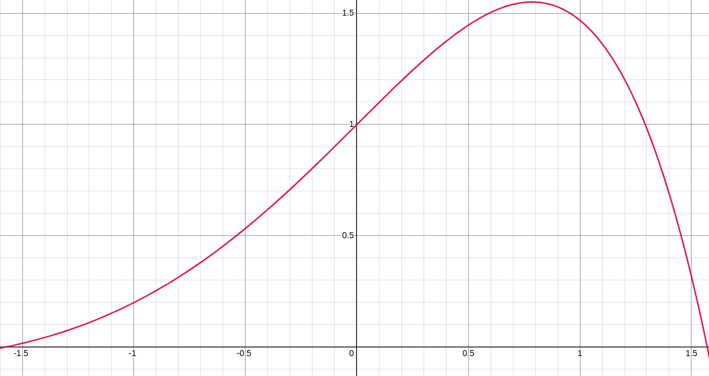
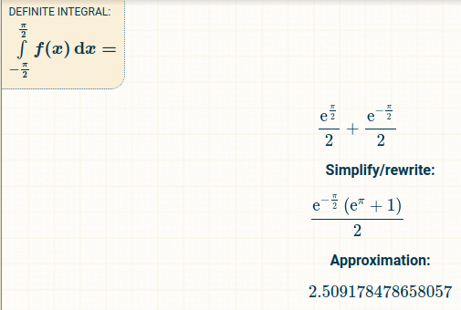
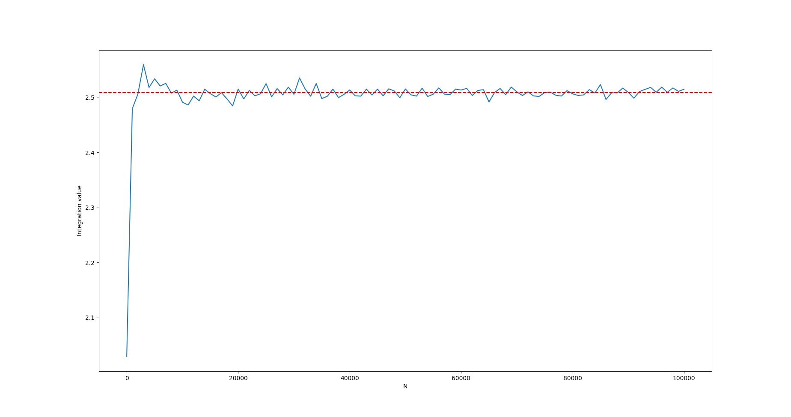

# Assignment-2
# 2021101113
# Science - II
# Q2
# Gowlapalli Rohit
>##### All these commands are tested on Ubuntu Version 20.04.3 LTS (Focal Fossa) 
```
Q2
├── Q2a.py
├── Q2b.py
└── Q2.pdf
```
```
e^xcosx in the range [-π/2, π/2]
```
---------------------------------------------------------------------------------------------------------------------------------------------------------




---------------------------------------------------------------------------------------------------------------------------------------------------------
>* Q2-part-b

