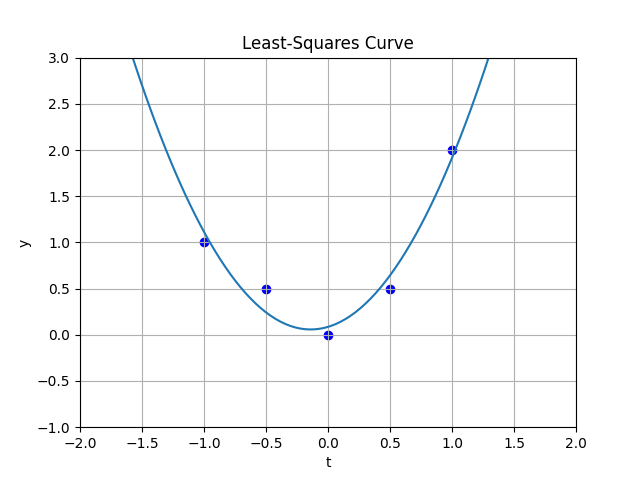

# Assignment-1
# 2021101113
# Science - II
# Gowlapalli Rohit

>##### All these commands are tested on Ubuntu Version 20.04.3 LTS (Focal Fossa) 
```
Q1
├── Q1_graph.pdf
├── Q1_written.pdf
└── Q1.py
```
```
Q1_written.pdf contains written solution to the Least squares problem as asked in the Assignment pdf
```
> * Q1

`$ python3 Q1.py`  
```cpp
import matplotlib.pyplot as plt
import numpy as np
data = [(-1, 1), (-0.5, 0.5), (0, 0), (0.5, 0.5), (1, 2)]
A = np.array([[t**2, t, 1] for t, y in data])
Y = np.array([y for t, y in data])

def plot_curve(data, coef):
    t = [point[0] for point in data]
    y = [point[1] for point in data]
    plt.scatter(t, y, color ='b') 
    plt.xlabel('t')
    plt.ylabel('y')
    plt.title('Least-Squares Curve')
    plt.grid(True)
    plt.xlim(min(t)-1, max(t)+1)
    plt.ylim(min(y)-1, max(y)+1)
    t_values = np.linspace(min(t)-1, max(t)+1, 100)
    plt.plot(t_values, coef[0]*t_values*t_values + coef[1]*t_values + coef[2])
    plt.show()

coefficients = np.linalg.inv(A.T @ A) @ A.T @ Y
print(coefficients)
plot_curve(data, coefficients)
```
```
a1 = 1.42857143
a2 = 0.4        
a3 = 0.08571429

```

