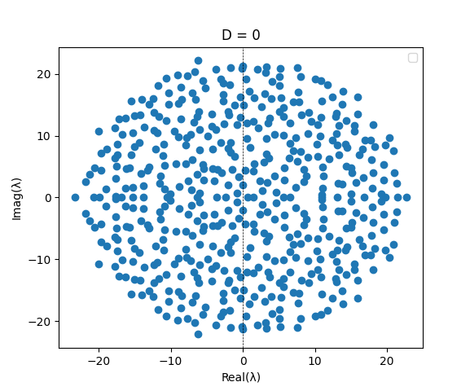
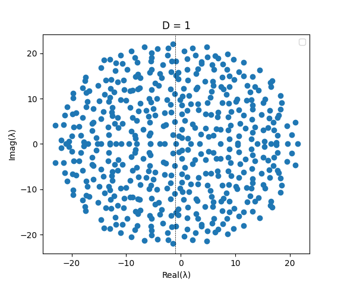
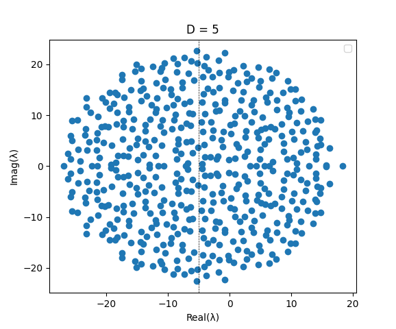
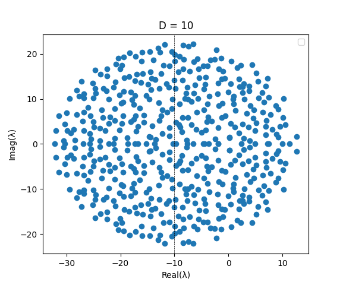
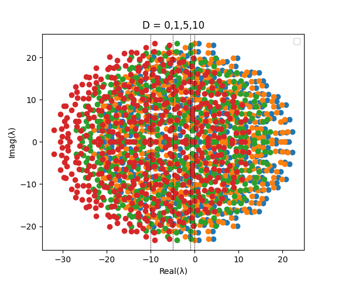
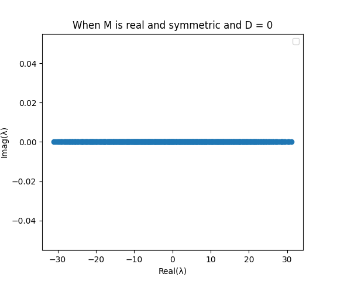
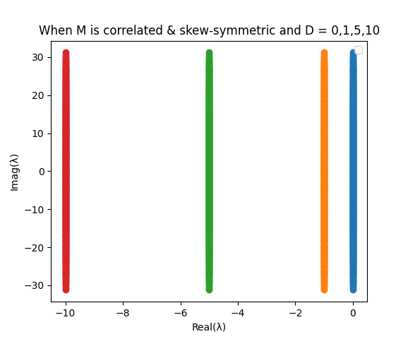
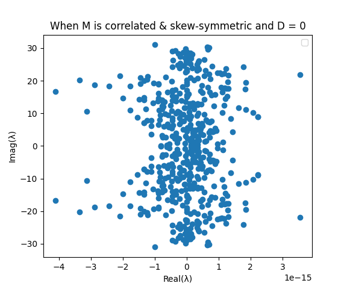

# Assignment-1
# 2021101113
# Science - II
# Gowlapalli Rohit

>##### All these commands are tested on Ubuntu Version 20.04.3 LTS (Focal Fossa) 
```

```

> * Q3

`$ python3 Q3.py`
```cpp
import numpy as np
import matplotlib.pyplot as plt
M = np.random.normal(loc=0, scale=1, size=(500, 500))
for D in [0,1,5,10]:
    # Add diagonal elements to matrix
    np.fill_diagonal(M, -D)
    eigenvalues = np.linalg.eigvals(M)
    plt.scatter(np.real(eigenvalues), np.imag(eigenvalues))

plt.xlabel("Real(λ)")
plt.ylabel("Imag(λ)")
plt.show()
```

```cpp
import numpy as np
import matplotlib.pyplot as plt
N = 500
M = np.random.normal(loc=0, scale=1, size=(500, 500))

# Plot eigenvalues for different values of D
# for D in [1]:
    # Add diagonal elements to matrix
D = 1
np.fill_diagonal(M, -D)
M = (M + M.T)/2
eigenvalues = np.linalg.eigvals(M)
plt.scatter(np.real(eigenvalues), np.imag(eigenvalues))
plt.xlabel("Real(λ)")
plt.ylabel("Imag(λ)")
plt.show()
``` 
```cpp
import numpy as np
import matplotlib.pyplot as plt
N = 500
M = np.random.normal(loc=0, scale=1, size=(500, 500))
for D in [0,1,5,10]:
    N = (M - M.T)/2
    np.fill_diagonal(N, -D)
    eigenvalues = np.linalg.eigvals(N)
    plt.scatter(np.real(eigenvalues), np.imag(eigenvalues))
plt.xlabel("Real(λ)")
plt.ylabel("Imag(λ)")
plt.show()
``` 
 



 

```
a) The shape in the plot is likely to be a cloud of scattered points , as the eigen values are complex numbers
b) As the value of -D increases , the eigen values will move closer to the origin of complex plane
```
### c) If the matrix is real and symmetric , then all eigen values will be real numbers and the plot will show a scatter of points along the real axis only

 

##### What will happen if the random elements in the matrix are correlated? E.g if M ij >0 then Mji <0.
1. Large complex systems which are assembled (connected) at random may be expected to be stable up to a certain critical level of connectance, and then, as this increases, to suddenly become unstable
2. If the random elements in the matrix are correlated (Consider the example where if Mij > 0 and Mji<0) , then the matrix will be skew-symmetric . A skew symmetric matrix is a square matrix whose transpose is equal to its negative . If A is skew-symmetric , then A^T = -A
3. Skew symmetric matrices have some special properties , one of them is that their eigen values will have zero real part and the plot will show a scatter of points along the imaginary axis only and they are always orthogonal matrices and hence their eigenvectors form an orthogonal basis

 



