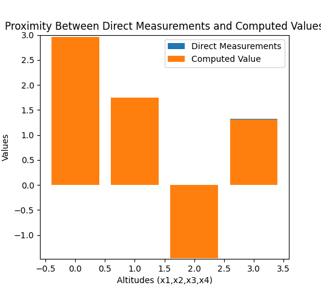

# Assignment-1
# 2021101113
# Science - II
# Gowlapalli Rohit

>##### All these commands are tested on Ubuntu Version 20.04.3 LTS (Focal Fossa) 
```

```

> * Q4

`$ python3 Q4.py` 
```cpp

// Code for finding the Least squares solution
import matplotlib.pyplot as plt
import numpy as np
data = [[1,0,0,0,2.95],[0,1,0,0,1.74],[0,0,1,0,-1.45],[0,0,0,1,1.32],[1,-1,0,0,1.23],[1,0,-1,0,4.45],[1,0,0,-1,1.61],[0,1,-1,0,3.21],[0,1,0,-1,0.45],[0,0,1,-1,-2.75]]
A = np.array([[a,b,c,d] for a,b,c,d,e in data])
Y = np.array([y for a,b,c,t,y in data])
coefficients = np.linalg.inv(A.T @ A) @ A.T @ Y
print(coefficients)

```cpp


```
```cpp

// Code for Bar Graph
import matplotlib.pyplot as plt
import numpy as np
x_direct = np.array([2.95,1.74,-1.45,1.32])
x_computed = np.array([2.96,1.746,-1.46,1.314])
print(x_computed)
plt.bar(np.arange(4),x_direct,label = "Direct Measurements")
plt.bar(np.arange(4),x_computed,label = "Computed Value")
plt.xlabel("Altitudes (x1,x2,x3,x4)")
plt.ylabel("Values")
plt.ylim([-1.48,3.5])
plt.title("Proximity Between Direct Measurements and Computed Values")
plt.legend()
plt.show()
```
```
1. Setting up the corresponding least squares system and finding the best value of altitudes gives [x1,x2,x3,x4] = [2.96,1.746,-1.46,1.314]
2. These values are very close / vary slightly when compared with the direct measurements which indicates that the least sqaures solution has accurately estimated the unknown altitudes
```


